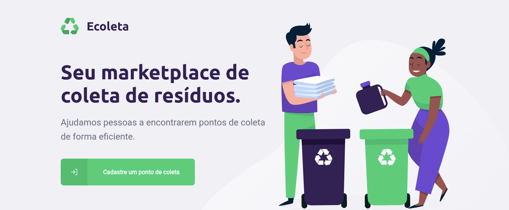
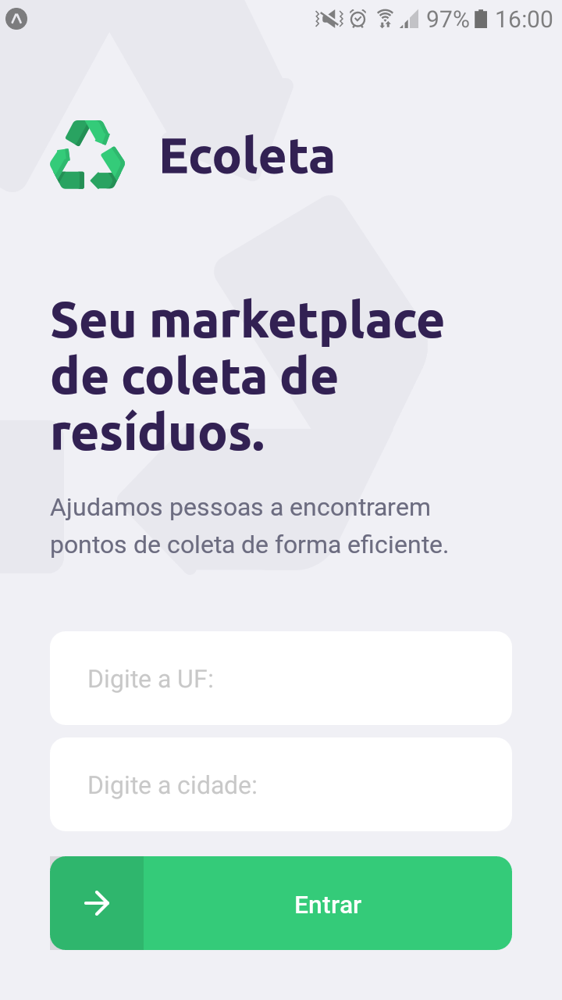
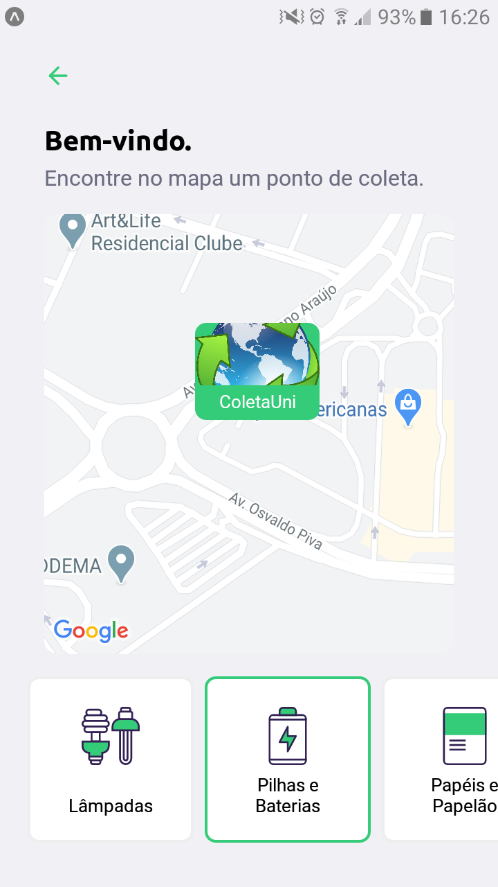
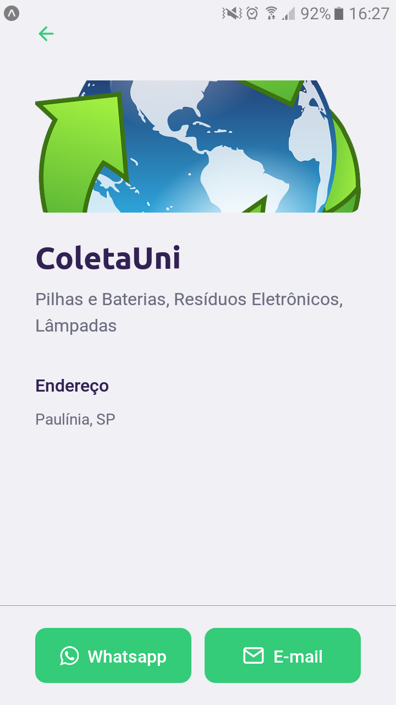

#### Website para cadastrar pontos

|    |
| --- |
Screenshot de cadastro de coletas [aqui](https://raw.githubusercontent.com/AlfredoFilho/NLW/master/images/create-point.png)

#### APP para consultar os pontos
|    |    |    |
| --- | --- | --- |
#
Como executar:
```
git clone https://github.com/AlfredoFilho/NLW
```
#
Configure a váriavel `ipv4Address` (Endereço ipv4 da rede) em:
```
NLW/mobile/src/services/api.ts
NLW/server/src/controllers/ItemsController.ts
NLW/server/src/controllers/PointsController.ts
```
#
 - Servidor [http://localhost:3333/](http://localhost:3333/):
```
cd NLW/
cd server/
npm install
npm run knex:migrate
npm run knex:seed
npm run dev
```
#
- Website [http://localhost:3000/](http://localhost:3000/):
```
cd NLW/
cd web/
npm install
npm start
```
#
- Mobile:<br/>
Instalar app Expo: [Android](https://play.google.com/store/apps/details?id=host.exp.exponent) / [IOS](https://apps.apple.com/br/app/expo-client/id982107779)
```
cd NLW/
cd mobile/
npm install
npm start
```
Vá para [http://localhost:19002/](http://localhost:19002/) e escaneie o QR Code com o app Expo
#
